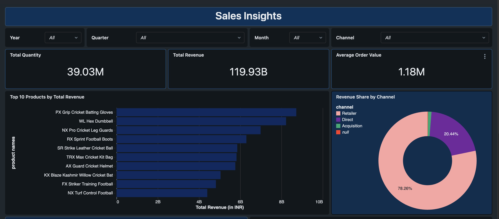

# 🚀 End-to-End Data Engineering Pipeline Using Databricks and Amazon S3

This project implements a production-style data engineering pipeline using **Databricks**, **Spark SQL**, and **Amazon S3**.  
It supports full-load ingestion, daily incremental updates, Bronze–Silver–Gold architecture, workflow automation, UPSERT logic, and analytics-ready fact/dimension tables.

---

# 🧱 Architecture Overview

## Bronze → Silver → Gold Architecture  

---

# 📦 Dataset Overview

The pipeline uses four key datasets:

- customers  
- products  
- gross_price  
- orders (full load + incremental)

---

# ⚙️ Tech Stack

- Databricks Community Edition  
- Spark SQL / PySpark  
- Amazon S3  
- Databricks Workflows  
- Lucidchart (ERD)  
- Databricks Dashboard  
- Genie  

---

# 📂 Repository Structure

- /architecture → ERD, workflow diagram, BSG architecture
- /notebooks → SQL notebooks for Bronze, Silver, Gold

---

## Workflow Stages

### 1. Bronze Stage
- Raw ingestion from S3  
- Stores unmodified data  
- Basic schema inference  

### 2. Silver Stage
- Removes duplicates  
- Handles nulls and invalid rows  
- Enforces data types  
- Standardizes dates  
- Filters inconsistent values  

### 3. Gold Stage
- Creates fact/dimension tables  
- dim_customers, dim_products, dim_gross_price  
- fact_orders  
- Parent–child table UPSERT  

---

## Workflow Schedule & Automation

- Runs nightly at **11 PM**  
- Executes all notebooks in sequence  
- Sends **email alerts** on failure  
- Fully automated incremental ETL

---

# 🧩 Data Model (ER Diagram)
 

Includes:
- fact_orders  
- dim_customers  
- dim_products  
- dim_gross_price  

---

# 🔁 Incremental Load Processing

The pipeline:
- Detects new files  
- Loads them to Bronze  
- Cleans them in Silver  
- Merges them in Gold using UPSERT  

---

# 🧪 Technical Results

## Data Quality Improvements
- ~4.8% duplicate rows removed  
- ~3.1% null/invalid rows corrected  
- 100% standardized date formats  
- Consistent schema enforced  

## Pipeline Performance
- ~35% faster transformation after SQL optimization  
- 100% successful workflow runs  
- UPSERT resolved ~6% mismatched rows  

---

# 📊 Dashboards

 

---

# 🧠 Key Learnings

- Medallion architecture (Bronze–Silver–Gold)  
- Incremental ETL  
- Data quality enforcement  
- Fact/dimension modeling  
- UPSERT logic  
- Workflow automation  
- Spark SQL optimization  

---

# ⭐ Why This Project Matters

This repo demonstrates real-world data engineering skills:
- Cloud-based ETL  
- Automated workflows  
- Dimensional modeling  
- Incremental loads  
- Data quality processing  
- Scalable pipeline design

